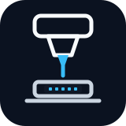

<p align="center">
  
</p>

<h1 align="center">Semi Auto Probe</h1>

<p align="center">
  <a href="#overview"></a>
  <a href="#hardware"></a>
  <a href="#software"></a>
  <a href="#cost-summary"></a>
  <a href="#development"></a>
</p>

<p align="center">
  An open-source semi-automatic probe station that combines a motorized XYZ stage, microscope vision, probe manipulation, autofocus, and stitched-field imaging in one reproducible desktop workflow.
</p>

<p align="center">
  <a href="#overview">Overview</a> |
  <a href="#hardware">Hardware</a> |
  <a href="#software">Software</a> |
  <a href="#getting-started">Getting Started</a> |
  <a href="#development">Development</a>
</p>

## Overview

`Semi Auto Probe` is an open-source probe-station project with both hardware and software layers:

- **Hardware stack:** a motorized `XYZ` micro-positioning stage, 5-phase stepper motor drive electronics, a 4-axis motion-control board, microscope optics, a USB camera, probe arms, tungsten probes, and optical-platform fixtures.
- **Software stack:** a Python desktop application that controls motion over RS-232, displays live microscope video, supports visual metrology, performs autofocus, and captures stitched mosaics.
- **System goal:** make a compact semi-automatic probing workflow reproducible enough that another lab or maker can understand what to buy, how the pieces fit together, and what the software contributes.

The physical build uses a 4-axis controller, but the application intentionally operates the first three axes as `X`, `Y`, and `Z`. The stage provides precise motion, the microscope stack provides visual feedback, and the software ties them together into a practical workflow for device probing and imaging.

### What the system can do

- Drive a 3-axis probe stage over `115200, N, 8, 1`
- Show live USB microscope video with focus overlays
- Move visible image points to the field center after calibration
- Run autofocus on the `Z` axis with multiple focus metrics
- Capture serpentine mosaics with FFT-based image registration
- Build and reuse FocusMap planes for tilted samples
- Capture GDS-aligned image matrices, time stacks, and Z stacks
- Run assisted AutoTest point grids with photos, Keithley 2450 IV sweeps, WobbTest contact optimization, and Keysight B1500 transfer/output curves
- Trace selected GDS edges with FocusMap-aware safe/start/contact motion
- Expose a token-protected browser dashboard for remote AutoTest session history and file access
- Plan guarded high-level workflows from the AI Agent panel
- Expose raw communication tools for controller debugging

### Strategic roadmap

The project roadmap focuses on three core technological enhancements:

- **Mechanical micro-nanofabrication:** develop an automated mobile platform for non-chemical-contact pattern processing, enabling precision patterning of 2D materials inside a controlled glovebox environment while reducing chemical contamination and interface damage.
- **Integrated optical systems:** upgrade the platform with multi-channel monochromatic light sources and DMD-based spatial light modulation, expanding the system toward PL in-situ testing and high-resolution photocurrent mapping.
- **High-stability electrical control:** transition toward a robust modular architecture with standardized wire-bonding array boards, moving beyond traditional probe-based workflows to improve testing efficiency and signal stability for multi-array devices.

## Hardware

The tables below list the hardware actually used in this build. Purchase links are intentionally omitted; the goal is to document the bill of materials and the rough cost of reproducing a comparable setup.

### Cost summary

| Subsystem | Main hardware | Cost |
| --- | --- | ---: |
| Microscope system | `sanqtid` coaxial microscope lens, focusing stand, USB microscope camera | `SGD 770.98` |
| Probe system | Probe holders, 3-axis probe fixtures, probe stage, tungsten probes | `SGD 1,219.51` |
| Motion and control | `KOHZU` motorized XYZ stage, `KOHZU MD-355F` driver, 4-axis controller, RS-232 cable | `SGD 1,161.93` |
| Optical-platform accessories | Magnetic base plates and M6 optical posts/adapters | `SGD 325.37` |
| **Total** |  | **`SGD 3,477.79`** |

> The total above is based on the saved order pages and their displayed `SGD` paid amounts. Some orders note that consolidated cross-border shipping can be paid separately, so any later standalone forwarding fees are not included here.

### Microscope system

| Item | Model / specification | Notes |
| --- | --- | --- |
| Coaxial microscope lens | `sanqtid` `3200x` coaxial-light lens | Listed as a 400-3600x industrial electronic microscope lens |
| Focusing support | `sanqtid` stereo fine-focus stand | 76 mm support with fine adjustment |
| Microscope camera | USB2.0 microscope camera, `5.1 MP` | Used for live vision, focus scoring, and mosaic capture |

### Probe system

| Item | Model / specification | Notes |
| --- | --- | --- |
| Left probe holder + 3-axis fixture | `JY050-12-L + JY800-1.5-TRB` | Manual precision positioning |
| Right probe holder + 3-axis fixture | `JY050-12-R + JY800-1.5-TRB` | Manual precision positioning |
| Additional probe stage | 3-axis probe sliding fixture | Listed as probe holder plus 3-axis clamp |
| Tungsten probes | `WG-38-0.5`, `WG-38-1.0`, `WG-38-2.0`, `WG-38-5.0` | Probe-tip sizes span roughly 1-10 micrometers across purchased variants |

### Motion and control system

| Item | Model / specification | Notes |
| --- | --- | --- |
| Motorized stage | `KOHZU` electric `XYZ` precision stage | Listed travel: `20 x 20 x 9 mm` |
| Motor driver | `KOHZU MD-355F` | 3-axis driver for 5-phase stepper motors; up to 250 microstep divisions |
| Motor type | 5-phase stepper motor | Driver datasheet uses a `0.72 deg` basic step angle |
| Motion controller | 4-axis controller module | RS-232 by default, with 16 NPN inputs and 16 transistor outputs |
| Serial adapter | USB to RS-232 cable | Used between the PC and controller |

Local reference documents for this subsystem are kept in [`refs/`](refs/):

- [`MotorDriverDatasheet.pdf`](refs/MotorDriverDatasheet.pdf)
- [`ControlUnitDatasheet.pdf`](refs/ControlUnitDatasheet.pdf)
- [`4-Axis Controller Communication Protoco·.pdf`](refs/4-Axis%20Controller%20Communication%20Protoco%C2%B7.pdf)
- [`Comm Protocal.txt`](refs/Comm%20Protocal.txt)

### Optical-platform accessories

| Item | Model / specification | Quantity |
| --- | --- | ---: |
| Magnetic optical base plate | `LPTP20080` | `3` |
| M6 optical post / adapter | `LPMP125`, 25 mm | `12` |
| M6 optical post / adapter | `LPMP1100`, 100 mm | `12` |
| M6 optical post / adapter | `LPMP1150`, 150 mm | `12` |

## Software

The software is a Python desktop application for operating the semi-automatic station. It combines motion control, microscope vision, calibration, autofocus, and imaging workflows in one interface.

### Core capabilities

- 3-axis controller integration over serial communication
- Live USB camera preview with focus-score overlays
- Visual tools for point-to-point distance, point-to-line distance, polygon area, and image-point centering
- Autofocus with coarse search, refinement, focus-history plots, and CSV export
- FocusMap plane generation, 3D plane visualization, save/load, and optional Z lock for mapped XY moves
- Serpentine image stitching with flat-field correction, FFT phase-correlation registration, quality overlay, manual recomposition, T-stack, and Z-stack acquisition
- Read-only GDS layout viewing, affine GDS-to-stage calibration, live FOV overlay, matrix overlays, and two-step click-to-move navigation
- GDS-aligned ImgMatrix capture with per-session image output and manifest files
- AutoTest automation for layout-defined point arrays, probe-assist overlays, contact approach, photo capture, IV/WobbTest/B1500 measurement flows, and per-device result folders
- EdgeTrace planning from GDS geometry with work bounds, path preview, safe-height moves, start moves, contact moves, segment execution, and auto-run mode
- AI Agent planning panel with live hardware context, rule-based fallback, LLM planner support, and confirmation-gated workflow execution
- Read-only FastAPI web dashboard with token-protected AutoTest session, JSON metadata, file download, and client-connection endpoints
- Persistent local configuration for optical calibration and motor mapping
- Raw TX/RX communication console for protocol debugging

### Application pages

| Page | Purpose |
| --- | --- |
| `Main` | Live vision, visual measurement, image-point centering, keyboard/jog motion, probe-down guard, GDS/FOV overlays, position readout, administrator-gated three-axis homing, zeroing |
| `Communication` | Raw command entry, communication-test frame loading, last TX/RX display, hex history |
| `AutoFocus` | Z autofocus, focus metric selection, score plots, manual Z jog, Z zeroing |
| `FocusMap` | AF-plane mesh setup, autofocus sampling, plane fitting, 3D visualization, mapping save/load, mapped-Z lock |
| `LayoutBond` / `LayoutMap` | Read-only GDS viewer, layer toggles, GDS/stage calibration, current FOV overlay, selected-target movement |
| `ImgStitch` | Serpentine mosaic capture, overlap settings, stitch preview, quality diagnostics, recomposition, T-stack, Z-stack, optional four-corner or FocusMap plane Z |
| `ImgMatrix` | GDS-aligned matrix acquisition using LayoutMap calibration, FOV preview overlays, per-tile capture, T-stack/Z-stack reuse |
| `AutoTest` | Grid/device automation with FocusMap-aware Z approach, probe-assist overlays, photos, Keithley IV, WobbTest, and Keysight B1500 flows |
| `EdgeTrace` | GDS edge/path selection, work-bound filtering, safe/start/contact steps, segment run, and auto edge tracing |
| `AI Agent` | Natural-language workflow planning, live microscope/context view, guarded execution of existing high-level workflows |
| `Config` | Objective/eyepiece selection, pixel calibration, motor mapping, controller speed read/write, conversion display |

### Supported protocol capabilities

- Communication feedback test
- Realtime position enable/disable
- Single-axis position reads
- I/O status reads for home inputs
- Three-axis Go Home with completion feedback
- Controller speed readback (`D5` / `B2`-`B4`) and temporary or power-off-persistent writes (items 10-13)
- Clear-position commands
- Single-axis relative and absolute moves
- 4-axis coordinated relative move command generation
- Coordinated-move completion handling
- Decelerated and emergency stops

### Instrument automation

AutoTest can combine motion, imaging, contact handling, and instrument measurements into one point-array workflow. Current measurement cards include:

| Flow | Instrument / action | Output |
| --- | --- | --- |
| `Entity Pause` | Timed wait between steps | Status log only |
| `Photo` | Current microscope frame | `autotest_session/<timestamp>/images/*.png` |
| `Keithley IV` | Keithley 2450 voltage or current sweep over VISA | `iv/*_iv.csv` plus JSON metadata |
| `WobbTest` | Contact-current search using Keithley 2450 while wobbling Z and optionally XY | `wobb/*_wobb.csv` plus JSON metadata |
| `B1500 Transfer` | Keysight B1500 FET `Id-Vg` curves with configurable drain/gate SMUs | long/wide/per-curve CSV files plus JSON metadata |
| `B1500 Output` | Keysight B1500 FET `Id-Vd` curves with configurable gate-bias list | long/wide/per-curve CSV files plus JSON metadata |

VISA-backed measurement flows require the relevant instrument, driver stack, and resource names to be available on the acquisition PC. The app validates parameters locally and writes outputs under `autotest_session/`.

## Getting Started

### Requirements

#### Hardware

- A compatible 4-axis motion controller connected through RS-232 or a USB-to-RS232 adapter
- A Windows-visible USB microscope camera
- A probe stage wired so the first three controller axes map to application axes `X`, `Y`, and `Z`
- Optional VISA instruments for automated electrical measurements: Keithley 2450 and/or Keysight B1500

#### Software

- Python `>=3.10`
- Recommended dependency manager: `uv`
- Python packages are declared in `pyproject.toml` and mirrored in `requirements.txt` for pip-based installs.
- GDS layout loading requires `gdstk`. If it is missing, the application still starts, but the `LayoutBond` page will ask you to install it.
- Web monitoring requires the declared `fastapi` and `uvicorn[standard]` dependencies.
- VISA measurement workflows require the declared `pyvisa` / `qcodes` packages plus a working local VISA backend.

### Installation

Create the local environment and install dependencies:

```powershell
uv sync
```

After dependency changes, refresh the uv lockfile and environment:

```powershell
uv lock
uv sync
```

If you only need to add the GDS dependency in an existing checkout, use:

```powershell
uv add gdstk
```

Run the GUI:

```powershell
uv run python -m semi_auto_probe
```

Restore the latest FocusMap plane and LayoutMap calibration on startup:

```powershell
uv run python -m semi_auto_probe --restore-last
```

or:

```powershell
uv run semi-auto-probe
```

Run the command-line communication test:

```powershell
uv run python -m semi_auto_probe.cli test --port COM3
```

The desktop app also supports the Raspberry Pi serial bridge. Install the Windows OpenSSH client and configure key/agent authentication for `icalculate@100.77.247.59`, then select `Remote / SSH` in the `SERIAL` toolbar and click `Connect`. Selecting remote mode or clicking `Refresh` checks the Pi service, physical motor serial connection, and bridge-session availability through SSH without opening a control session. The app owns a loopback-only local forward to the Pi's `127.0.0.1:9500` bridge and closes it when serial is disconnected.

Run the read-only web dashboard:

```powershell
$env:SEMI_AUTO_PROBE_WEB_TOKEN="change-this-token"
uv run semi-auto-probe-web
```

Then open:

```text
http://127.0.0.1:8000
```

See [`docs/web-deploy.md`](docs/web-deploy.md) and [`src/semi_auto_probe/web/README.md`](src/semi_auto_probe/web/README.md) for tray helpers, token setup, AutoTest file APIs, LAN binding, Cloudflare Tunnel deployment, and connection monitoring.

### First-run workflow

1. Connect the controller and camera.
2. Launch the app, select the correct serial port, and click `Connect`.
3. Click `Test` to verify controller feedback.
4. Open `Config`, confirm motor settings, select the active objective/eyepiece pair, and run pixel calibration if image-to-stage conversion is needed.
5. On `Main`, read the current position, verify axis direction, and use `Set New Zero` only after the stage is at the intended coordinate origin.
6. Use `AutoFocus` to find a usable `Z` position before imaging.
7. Use `FocusMap` if later LayoutMap, ImgMatrix, AutoTest, EdgeTrace, or ImgStitch steps need mapped Z compensation across a tilted sample.
8. Use `LayoutBond` / `LayoutMap` to bind GDS coordinates to stage coordinates when layout-aware motion or acquisition is needed.
9. Use `ImgStitch`, `ImgMatrix`, `AutoTest`, or `EdgeTrace` only after travel distance, overlap/FOV, contact behavior, and optional plane compensation have been checked.

## Workflow Details

### Main page

- Position cells show `X`, `Y`, and `Z`
- Single-click a coordinate cell to enter a relative move
- Double-click a coordinate cell to enter an absolute target
- `Move`, `Read`, `Continue`, jog controls, `Go Home`, zeroing, and emergency stop are available from the main motion panel
- `Go Home` sends protocol item 18 for all axes and remains disabled until Config admin mode is enabled
- Vision tools include `Center +`, `Point-Point`, `Point-Line`, `Polygon Area`, and `Move Center`

### LayoutBond

- Load read-only `.gds` files, display the selected top cell, toggle layers, zoom, pan, and fit the layout to view
- Cursor coordinates are snapped to a selectable GDS grid: `100 nm`, `1 um`, `5 um`, or `10 um`
- Calibration points `P1` to `P4` can be typed manually, set from the current stage position, or picked from the layout
- Click `Set GDS` to enter pick mode; the active button turns amber, then double-click a snapped layout point to fill the GDS coordinate and restore the button color
- After fitting the affine mapping, LayoutBond previews selected GDS targets in stage micrometers and moves only after `Move to Selected Target`
- FocusMap Z lock can move Z to the fitted plane during mapped XY movement when enabled

### AutoFocus

- Available metrics: `Laplacian`, `Tenengrad`, `Brenner`
- Search flow: center sample -> coarse sweep -> local refinement -> return to best usable `Z`
- Each run writes `last_autofocus_history.csv`

### FocusMap

- Generates autofocus sample meshes and records measured `X/Y/Z` points
- Fits a sample plane and shows residuals in a 3D view when Matplotlib is available
- Saves the latest mapping to `last_focusmap_mapping.json`
- Can lock later mapped XY moves to the stored plane Z
- Can be reused by `ImgStitch`, `ImgMatrix`, `AutoTest`, `EdgeTrace`, and `LayoutBond` movements

### Image stitching

- Traversal is serpentine
- Neighboring fields are registered with FFT phase correlation
- Flat-field correction is applied before stitching
- Final output is written to `last_imgstitch.png`
- Session data is written under `imgstitch_session/`, including raw tiles, `session.json`, recomposed images, stack outputs, and `last_imgstitch.png`
- T-stack and Z-stack modes can save fused images and optional raw frames
- Four-corner plane AF or a stored FocusMap plane can compensate tilted samples

### ImgMatrix

- Uses the fitted LayoutMap affine transform to generate a GDS-aligned row/column acquisition matrix
- Shows the planned FOV footprint on the layout before running
- Saves images to `imgmatrix_session/<timestamp>/images/`
- Writes `manifest.json` with settings, point metadata, output paths, and completion state
- Reuses the ImgStitch tile mode, T-stack mode, and Z-stack mode settings

### AutoTest

- Generates named device points from a layout origin and `U/V` vectors
- Requires LayoutMap mapping and FocusMap plane readiness before motion execution
- Supports probe-assist overlays for Source, Drain, and Gate alignment
- Applies configurable fast/slow Z approach, down margin, Z offset, and optional Z wobble
- Runs measurement-flow cards in order: pause, photo, Keithley IV, WobbTest, B1500 transfer, and B1500 output
- Saves per-run data under `autotest_session/<timestamp>/images/`, `iv/`, `wobb/`, and `b1500/`

### EdgeTrace

- Builds trace plans from visible GDS geometry and optional work bounds
- Uses LayoutMap for XY conversion and FocusMap for contact/safe Z values
- Provides separate safe move, start move, contact, segment, and auto-run actions
- Tracks completed polylines and current needle position in the layout viewer

### AI Agent

- Collects live serial, camera, position, LayoutMap, FocusMap, ImgStitch, and configuration context
- Plans only supported high-level actions; it does not emit raw serial commands
- Falls back to a rule-based planner when no LLM API key is configured
- Supports conversation-only, authorized-step, and automatic-step permission modes
- Re-checks local blockers before executing each step

### Web dashboard

- Runs as `semi-auto-probe-web` using FastAPI and Uvicorn
- Serves a token-protected read-only dashboard for AutoTest session history, run files, JSON metadata, image previews, downloads, and active client connections
- No longer publishes or proxies camera frames through the web service
- Listens on `127.0.0.1:8000` by default and can be configured with `SEMI_AUTO_PROBE_WEB_HOST`, `SEMI_AUTO_PROBE_WEB_PORT`, `SEMI_AUTO_PROBE_WEB_TOKEN`, `SEMI_AUTO_PROBE_AUTOTEST_SESSION_DIR`, and related environment variables

### Configuration

Local settings are stored in:

```text
probe_config.local.json
```

The configuration page controls optical calibration, active objective/eyepiece selection, camera source/resolution/exposure/gain, motor microstep settings, axis polarity, speed profiles, controller motion parameters, keyboard jog levels, focus thresholds, Agent API settings, and derived `um/pulse` conversions. Controller speed values are read only on demand from this page; item 10/11 applies temporary values and item 12/13 saves power-off-persistent values.

Core-field example:

```json
{
  "active_motor_speed_profile": "fast",
  "agent_base_url": "https://api.deepseek.com",
  "agent_model": "deepseek-chat",
  "base_angle_deg": 0.72,
  "camera_fov_rotation_deg": 0.0,
  "camera_resolution_width": "half",
  "camera_source": "auto",
  "calibrations": {
    "objective_20__eyepiece_1.5": 0.42
  },
  "cc_accel_time_s": 0.3,
  "cc_speed_percent": 100,
  "eyepiece": 1.5,
  "fine_speed_percent": 40,
  "lead_xy_mm": 1.0,
  "lead_z_mm": 0.5,
  "microstep": 2,
  "motor_axis_polarity": {
    "X": 1,
    "Y": 1,
    "Z": 1
  },
  "objective": 20,
  "safe_speed_percent": 15
}
```

## Project Layout

```text
src/semi_auto_probe/
  app.py                   Tkinter application and workflow orchestration
  agent.py                 AI Agent planning contracts and rule/LLM planners
  auto_test.py             AutoTest point-grid UI and measurement-flow definitions
  b1500.py                 Keysight B1500 transfer/output sweep runner
  camera.py                USB camera capture, overlays, focus metrics
  camera_stage_transform.py Camera-to-stage coordinate transforms
  config.py                Persistent optical/motor configuration
  edge_trace_panel.py      GDS edge trace UI and motion-plan panel
  focusmap_3d.py           FocusMap 3D visualization
  gds_edge_trace.py        GDS edge extraction and trace-plan generation
  gds_stage_mapper.py      GDS viewer and affine stage mapping
  img_matrix.py            GDS-aligned matrix acquisition planning
  protocol.py              Frame builders and response parsers
  serial_client.py         Thread-safe serial transport helpers
  img_stitch.py            Stitching, flat-field correction, plane fitting
  keithley2450.py          Keithley 2450 IV and contact-current helpers
  monitor_feed.py          Local desktop camera/status publisher
  web_app.py               Read-only FastAPI monitoring dashboard
  web/static/              Browser dashboard assets
  ui/vision.py             Main-page visual tools
  ui/calibration_dialog.py Pixel-calibration dialog
```

## Generated and Local Files

| File | Meaning |
| --- | --- |
| `probe_config.local.json` | Local optical/motor configuration |
| `last_autofocus_history.csv` | Most recent autofocus sampling history |
| `last_focusmap_mapping.json` | Most recent FocusMap plane/mapping payload |
| `last_layoutbond_mapping.json` | Most recent LayoutMap calibration payload |
| `last_imgstitch.png` | Most recent stitched mosaic |
| `imgstitch_session/` | Latest stitch/stack session tiles, JSON, and recomposed output |
| `imgmatrix_session/<timestamp>/` | ImgMatrix images and manifest |
| `autotest_session/<timestamp>/` | AutoTest images, IV CSV/JSON, WobbTest CSV/JSON, and B1500 outputs |
| `.runtime/` | Web-service PID files and local runtime logs |

These files are ignored by Git and are safe to keep local.

## Development

Run the full test suite:

```powershell
uv run python -m unittest discover -s tests
```

If you run tests outside the project environment, make sure the active interpreter has `opencv-python`, `numpy`, and `pyserial` installed. Importing the GUI stack also imports stitching code, so OpenCV is required even for some non-camera tests.
For GDS viewer tests or manual GDS loading, the interpreter also needs `gdstk`.

## Troubleshooting

### No serial ports appear

- Confirm the adapter is visible in Windows Device Manager
- Install the USB-to-RS232 driver if required
- Click `Refresh` after connecting the adapter

### Communication test fails

- Confirm the selected COM port
- Confirm controller power and RS-232 wiring
- Verify the controller uses `115200, N, 8, 1`
- In `Remote / SSH` mode, verify key-based SSH login works and that another remote session is not already using the Raspberry Pi bridge

### Camera preview is unavailable

- Try another camera index
- Close other applications already using the camera
- Click `Restart`

### GDS loading says gdstk is missing

- If you use `uv`, run `uv sync` after pulling the latest dependency files.
- If the lockfile has not been updated yet, run `uv lock` and then `uv sync`.
- For a local one-off fix, run `uv add gdstk`; this writes the dependency to `pyproject.toml` and updates the uv environment.

### Vision move is disabled

- Run pixel calibration for the currently selected objective/eyepiece pair
- Confirm the stage conversion settings are correct before using image-to-stage moves

### Stitching quality is poor

- Verify overlap values match the actual field overlap
- Recheck flat-field behavior under the current illumination
- Confirm the configured physical step sizes match the current optical calibration and motor mapping
- Enable plane AF when the sample surface is tilted across the stitched area

## Safety Notes

- Verify axis directions at low jog distances before using large moves
- Confirm the coordinate origin before using `Set New Zero`
- Keep the emergency-stop path accessible during any automated motion
- Use conservative `Z` ranges until sample clearance is known
